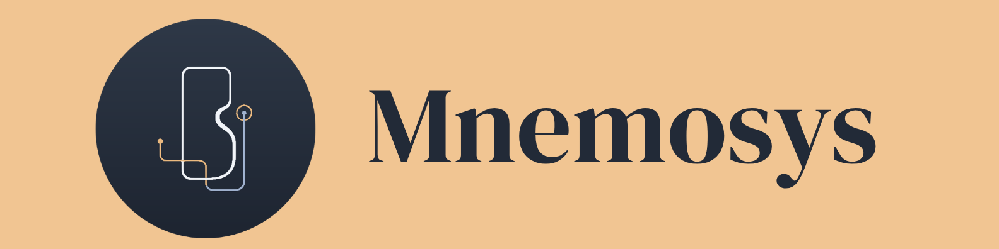

# Mnemosys

---

Mnemosys is a shared workspace for durable organizational knowledge.
It keeps documentation in portable Markdown files owned by the user.
People can organize pages through nested folders and browse them visually.
Each page carries a name and an editable description.
Wiki links connect pages, folders, and subfolders using familiar notation.
Folder relationships are represented automatically without manual linking.
The graph view makes both structural and explicit connections visible.
Writing and reading remain equally accessible through editing and preview modes.
Local storage selection keeps everything inside a dedicated Mnemosys-Vault folder.
Mnemosys focuses on making collective memory understandable and easy to maintain.

---

## Quickstart

### Install

```bash
npm --prefix frontend install
```

### Run

Run these commands in two separate terminals:

```bash
go run ./apps/api
```

```bash
npm --prefix frontend run dev
```
