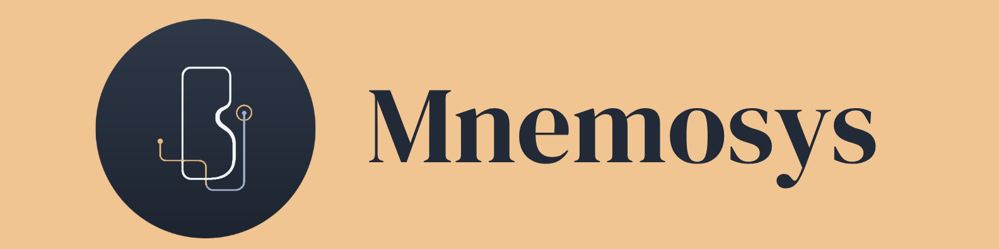

# Mnemosys

---

Mnemosys is a shared workspace for durable organizational knowledge. It keeps documentation in portable Markdown files owned by the user, organized through nested folders, ordinary wiki links, and a knowledge graph.

Each page stores stable identity metadata, its page type, owner name, configurable team, concerned application name, application-relative folder path, modification actor, AI-touch state, and timestamp in Markdown frontmatter. Descriptions are not stored. Pages include `ai_editable: false` by default; a human can enable AI editing by editing the Markdown frontmatter. The backend enforces this per-page protection in addition to the selected AI profile permissions. Metadata is kept exclusively in the Markdown file, is not duplicated in an application panel, and is excluded from rendered Markdown previews.

The landing page is a profile page. A new installation starts with no profiles. Add a human profile with first and last names to start using documentation; add AI profiles with a single name and assign view, create, edit, and delete rights to each one when creating or editing it. Human profiles have full browser access. Existing single-profile configurations are migrated when saved, preserving their identity and AI permission settings. Profiles and the active human profile are stored in `config/config.toml`. The Settings drawer manages storage only. Pages, folders, and media stay inside a dedicated `Mnemosys-Vault` directory. There is no database.

AI document changes are submitted as Markdown work items with explicit statuses: draft, in review, needs human input, approved, rejected, or merged. Each affected document shows its own merge proposals with a highlighted line-based diff. Human reviewers can edit the proposed Markdown, change its collaboration status, merge it, or reject it directly on that page. Merging refreshes the displayed page and its revision; save or resolve local page changes before merging. The read-only **Merge requests** tab below Documentation lists all requests, with status counts, search, status filters, submitted diffs, and links to the affected pages. Review actions are available only on the document page. New MCP proposals appear automatically within five seconds without reloading the browser. A proposal never changes the stored page until it is explicitly merged; resolved proposals remain visible as history.

Pages can reference files or folders with an ordinary wiki link such as `[[architecture]]` or `[[architecture|Architecture]]`. The editor link picker creates these links, backlinks identify references, and the graph displays each link edge.

Documentation search offers three selectable modes. Names mode matches file and folder paths and ignores Markdown page content. Lexical mode (shown as Metadata in the app) is the default and ranks exact terms across names, paths, every standard frontmatter value, and Markdown content. You can search values directly, including UUIDs, one-character names, booleans, folder paths, and timestamps. Use `field: value` to restrict a search to one frontmatter field, for example `team: Robotic`, `ai_editable: false`, or `application: ""` for an empty value. The supported fields are `id`, `name`, `page_type`, `owner`, `team`, `application`, `folder_path`, `ai_editable`, `last_modified_by`, `ai_touched`, and `updated_at`. Hybrid mode (shown as Semantic) keeps lexical matching and adds local semantic ranking derived from term context across the vault; field filters remain exact in both modes. Results identify whether they matched by name, lexically, semantically, or through both lexical and semantic signals. Search remains local and requires no external embedding service or database.

Multiple people and agents can edit through the same Mnemosys server without silently overwriting one another. Every document read includes a content revision, and autosave submits that revision with its update. Content updates require `baseRevision` at both the REST and service layers; missing revisions are rejected before any accompanying move or write. If another writer saved first, Mnemosys keeps the local draft, returns the latest saved Markdown to clients with view permission, and asks the editor to review it before either loading the latest version or explicitly replacing it. Edits to different pages do not conflict, while same-page conflicts are resolved deliberately.

Concurrent AI submissions for the same page remain separate proposals with independent IDs and review statuses; new submissions do not replace other proposals or resolved history. Only the Human profile can merge a proposal. If the stored page no longer matches its original content, merging returns an edit conflict with the current document and leaves both the page and proposal unchanged. Review the latest page and submit a revised proposal instead of retrying the stale merge.

This is revision-based collaboration through one server process, not live character-by-character coediting or automatic merging. Filesystem mutations are serialized within that process. Independent server processes and direct external file edits are not coordinated. The browser/REST profile remains shared application state rather than a separate authenticated identity per person; MCP calls always use AI permissions. Proposals and their history remain in memory only and are lost on server restart.

---

## Quickstart

### Install

```bash
npm --prefix frontend install
```

### Run

Run these commands in two separate terminals:

```bash
go run ./apps/api
```

```bash
npm --prefix frontend run dev
```

Open the app, add a human profile on the Profiles page, then choose a storage folder in Settings. Add AI profiles on the same page and assign their rights there.

## Native MCP for local agents

For English walkthroughs, see [Write to a page with Python](docs/mcp-python.md) and [Write to a page with TypeScript](docs/mcp-typescript.md). Each includes a standalone, readable script that finds an AI profile by name, initializes MCP, reads a page revision, and proposes appending text for human review. The Python client uses the standard library; the TypeScript client runs directly on Node.js 24 without npm packages.

Start the API as described above, then configure your agent's MCP client with the Streamable HTTP URL `http://127.0.0.1:8080/mcp` (adjust the port if you change `-addr`). The endpoint implements protocol version `2025-06-18`, initialization, ping, tool discovery, and tool calls. It returns JSON responses and uses no sessions or persistent SSE stream; GET and DELETE return HTTP 405. No separate MCP process or dependency is required.

The endpoint is intended for trusted agents on the same machine. It requires a loopback peer and a localhost/loopback Host, and rejects browser origins that differ from the API origin. It has no user authentication or remote-access configuration; do not expose it through a reverse proxy. Clients must send `Content-Type: application/json`, `Accept: application/json, text/event-stream`, and the negotiated `MCP-Protocol-Version: 2025-06-18` header after initialization. Request bodies are limited to 1 MiB.

MCP tool calls always act as AI. Configure each AI profile on the Profiles page, then send its `id` from `GET /api/settings/application` in the `X-Mnemosys-Profile-ID` header on MCP requests. The backend applies that profile's permissions and uses its name as the owner of created pages. New configurations deny MCP tool calls without a profile ID. The local MCP endpoint does not authenticate callers; profile IDs identify a policy, not a secret credential. Only trusted local agents should be given access to this endpoint.

| Tool | Arguments | Behavior |
| --- | --- | --- |
| `search` | `query`; optional `mode`, `scope` | Search names, metadata and content using `names` (file/folder paths only), `lexical` (default), or `hybrid` (lexical plus semantic ranking) mode. |
| `read` | `path` | Read a Markdown page, including frontmatter and its current revision. |
| `explore` | Optional `path` | Return the recursive vault tree or a folder's contents. |
| `create` | `path`, `type`; optional `content`, `pageType` | Create a `document` or `directory` immediately with AI create permission. Parents must exist; page type defaults to `general`. An agent cannot enable `ai_editable` at creation. |
| `delete` | `path` | Delete a page or folder recursively with AI delete permission. |
| `update` | `path`, `content`, `baseRevision` | Submit replacement Markdown as a proposal requiring human review. |
| `link` | `path`, `target`, `baseRevision`; optional `label` | Propose appending an ordinary wiki link to an existing page or folder. Page targets use stable UUID links. |
| `validate` | `path`; optional `content` | Check a stored page or proposed content against its UUID, page type and resolvable wiki links. Returns `valid` and `issues`; does not approve or merge a proposal. |

Paths are relative to the vault; document filenames must end in `.md`. To update or link, first call `read`, then pass its `revision` as `baseRevision`. Both tools require AI edit permission and the page's human-controlled `ai_editable: true`. A stale revision returns an error with the current document. Successful calls return a proposal for review and merge in the Mnemosys interface. Proposals currently live in server memory and are lost when the API restarts.

## Verification

```bash
GOCACHE=/tmp/mnemosys-go-cache go test ./...
npm --prefix frontend run build
```
